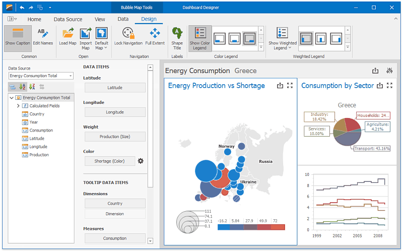

# Dashboard Designer
The **Dashboard Designer** provides an intuitive UI that facilitates data binding and shaping, and layout design. Many of these normally complex tasks can be accomplished with a simple drag-and-drop operation, allowing you to start creating dashboards immediately.

## Creating Dashboards
The following topics will guide you through the process of creating a dashboard.
* [Create a Dashboard](dashboard-designercreate-a-dashboard.md)
* [Provide Data](dashboard-designerprovide-data/provide-data.md)
* [Work with Data](dashboard-designerwork-with-data/work-with-data.md)
* [Add Dashboard Items](dashboard-designeradd-dashboard-items.md)
* [Bind Dashboard Items to Data](dashboard-designerbind-dashboard-items-to-data.md)
* [Dashboard Item Settings](dashboard-designerdashboard-item-settings.md)
* [Data Shaping](dashboard-designerdata-shaping.md)
* [Interactivity](dashboard-designerinteractivity.md)
* [Appearance Customization](dashboard-designerappearance-customization.md)
* [Data Analysis](dashboard-designerdata-analysis.md)
* [Convert Dashboard Items](dashboard-designerconvert-dashboard-items.md)
* [Dashboard Layout](dashboard-designerdashboard-layout.md)
* [Undo and Redo Operations](dashboard-designerundo-and-redo-operations.md)
* [Automatic and Manual Updates](dashboard-designerautomatic-and-manual-updates.md)
* [Save a Dashboard](dashboard-designersave-a-dashboard.md)

## Printing and Exporting
The Dashboard Designer provides the capability to print or export the individual items of a dashboard, as well as the entire dashboard.
* [Printing and Exporting](dashboard-designerprinting-and-exporting.md)

## UI Elements
The topics in this section describe the main elements of a Dashboard Designer application.
* [UI Elements](dashboard-designerui-elements.md)
