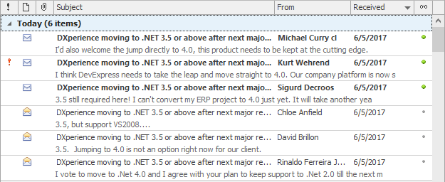

# Grid
This section describes the capabilities provided by the Grid control, which represents data in a tabular or card form, supports data editing, sorting, grouping, filtering, summary calculation and many other features:

&nbsp;

**Data Editing**
* [Edit Grid Cells](data-editing/edit-grid-cells.md)
* [Add and Delete Grid Records](data-editing/add-and-delete-grid-records.md)

&nbsp;

**Data Presentation**
* [Sort Grid Rows](data-presentation/sort-grid-rows.md)
* [Group Grid Rows](grid/data-presentation/group-grid-rows.md)
* [Fix Grid Rows](data-presentation/fix-grid-rows.md)

&nbsp;

**Data Analysis**
* [Filter Grid Data](data-analysis/filter-grid-data.md)
* [Show Summaries (Totals) in Grids](data-analysis/show-summaries-(totals)-in-grids.md)
* [Apply Cell Conditional Formatting](data-analysis/apply-cell-conditional-formatting.md)

&nbsp;

**Layout Customization**
* [Expand and Collapse Rows and Cards in Grids](layout-customization/expand-and-collapse-rows-and-cards-in-grids.md)
* [Hide and Display Grid Columns, Bands and Card Fields](layout-customization/hide-and-display-grid-columns-bands-and-card-fields.md)
* [Rearrange Grid Columns, Bands and Card Fields](layout-customization/rearrange-grid-columns-bands-and-card-fields.md)
* [Resize Cards in Grids](layout-customization/resize-cards-in-grids.md)
* [Resize Grid Columns, Bands and Card Fields](layout-customization/resize-grid-columns-bands-and-card-fields.md)

&nbsp;

**Selection and Navigation**
* [Locate Grid Records](selection-and-navigation/locate-grid-records.md)
* [Navigate Through Grid Records](selection-and-navigation/navigate-through-grid-records.md)
* [Select Grid Rows and Cards](selection-and-navigation/select-grid-rows-and-cards.md)
