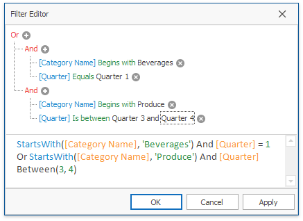
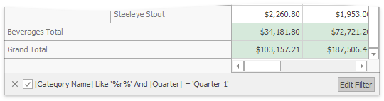

# Build Complex Filter Criteria
Use a Filter Editor to build complex filter criteria with an unlimited number of filter conditions, combined by logical operators.

To invoke the Filter Editor, click an empty space within the Pivot Table header region and select **Show Filter** from the context menu.

After you have built and applied a filter condition, a filter panel appears at the bottom of the Pivot Table. This panel displays the filter condition.

Click the **Edit Filter** button to invoke the Filter Editor and modify a filter condition.

To temporarily disable filtering, uncheck the  button.

To remove filtering, click the  button.

See also:
* [Filter Data via the Filter Editor](../../../filter-editor/filter-data-via-the-filter-editor.md) 
* [Examples of Using the Filter Editor](../../../filter-editor/examples-of-using-the-filter-editor.md)
